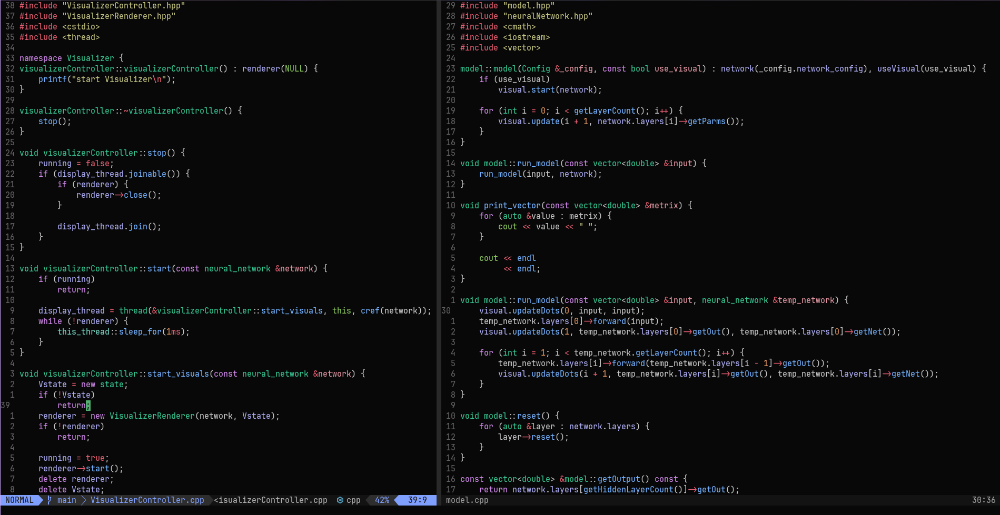

# Neovim Configuration

A modern, feature-rich Neovim configuration built with Lua, designed for efficient development across multiple programming languages.

## 📸 Screenshots

*Minimal and simple as well as beautiful theme thanks to [moonfly](https://github.com/bluz71/vim-moonfly-colors)*


## ✨ Features

- **Modern Plugin Management**: Uses [Lazy.nvim](https://github.com/folke/lazy.nvim) for fast, lazy-loaded plugin management
- **Language Server Protocol (LSP)**: Full LSP support with automatic server installation via Mason
- **Intelligent Code Completion**: Powered by [blink.cmp](https://github.com/saghen/blink.cmp)
- **Advanced Syntax Highlighting**: Tree-sitter integration with support for 12+ languages
- **Fuzzy Finding**: Telescope integration for file searching, live grep, and more
- **Debugging Support**: Built-in DAP (Debug Adapter Protocol) integration
- **Git Integration**: GitSigns, Diffview, and Fugitive for comprehensive Git workflow
- **Code Formatting**: Conform.nvim with language-specific formatters
- **Tmux Integration**: Seamless navigation between Neovim and Tmux panes
- **Enhanced UI**: Beautiful statusline with Lualine and moonfly theme

## 🚀 Installation

### Prerequisites

- Neovim >= 0.9.0
- Git
- A Nerd Font (for icons)

### Optional (Recommended)
- **ripgrep** - For faster Telescope live grep functionality
- **Node.js** - Required for some LSP servers (will be prompted if needed)

### Quick Setup

#### 🐧 Linux/macOS

1. **Clone this configuration**:
   ```bash
   git clone https://github.com/dredstone1/neovim-config.git ~/.config/nvim
   ```

#### 🪟 Windows

1. **Clone this configuration**:
   ```powershell
   # PowerShell/Git Bash
   git clone https://github.com/dredstone1/neovim-config.git ~/AppData/Local/nvim
   
   # Or use full path if above doesn't work
   git clone https://github.com/dredstone1/neovim-config.git "$env:LOCALAPPDATA/nvim"
   ```

#### 🔧 Final Steps (All Platforms)

2. **Open nvim**:
   ```bash
   nvim
   # nvim . // to open it as a project.
   ```

3. **Install plugins**: Lazy.nvim will automatically install all plugins on first launch.

**Note**: On first launch, you'll see plugins downloading - this is normal and only happens once!

## 📦 Plugins

### Core Functionality
- **[lazy.nvim](https://github.com/folke/lazy.nvim)** - Modern plugin manager
- **[plenary.nvim](https://github.com/nvim-lua/plenary.nvim)** - Lua utility functions
- **[nvim-web-devicons](https://github.com/nvim-tree/nvim-web-devicons)** - File type icons

### LSP & Completion
- **[nvim-lspconfig](https://github.com/neovim/nvim-lspconfig)** - LSP configuration
- **[mason.nvim](https://github.com/williamboman/mason.nvim)** - Portable package manager
- **[mason-lspconfig.nvim](https://github.com/williamboman/mason-lspconfig.nvim)** - Mason + LSP integration
- **[mason-tool-installer.nvim](https://github.com/WhoIsSethDaniel/mason-tool-installer.nvim)** - Auto-install tools
- **[blink.cmp](https://github.com/saghen/blink.cmp)** - Fast completion engine

### Code Intelligence
- **[nvim-treesitter](https://github.com/nvim-treesitter/nvim-treesitter)** - Advanced syntax highlighting
- **[conform.nvim](https://github.com/stevearc/conform.nvim)** - Code formatting
- **[Comment.nvim](https://github.com/numToStr/Comment.nvim)** - Smart commenting
- **[nvim-autopairs](https://github.com/windwp/nvim-autopairs)** - Auto-close brackets
- **[todo-comments.nvim](https://github.com/folke/todo-comments.nvim)** - Highlight TODO comments

### Navigation & Search
- **[telescope.nvim](https://github.com/nvim-telescope/telescope.nvim)** - Fuzzy finder
- **[trouble.nvim](https://github.com/folke/trouble.nvim)** - Diagnostics and quickfix

### Git Integration
- **[gitsigns.nvim](https://github.com/lewis6991/gitsigns.nvim)** - Git decorations
- **[diffview.nvim](https://github.com/sindrets/diffview.nvim)** - Git diff viewer
- **[vim-fugitive](https://github.com/tpope/vim-fugitive)** - Git wrapper

### UI & Visual
- **[vim-moonfly-colors](https://github.com/bluz71/vim-moonfly-colors)** - Color theme
- **[lualine.nvim](https://github.com/nvim-lualine/lualine.nvim)** - Statusline (moonfly theme)
- **[render-markdown.nvim](https://github.com/MeanderingProgrammer/render-markdown.nvim)** - Markdown rendering

### Debugging
- **[nvim-dap](https://github.com/mfussenegger/nvim-dap)** - Debug Adapter Protocol
- **[nvim-dap-ui](https://github.com/rcarriga/nvim-dap-ui)** - Debug UI
- **[nvim-dap-virtual-text](https://github.com/theHamsta/nvim-dap-virtual-text)** - Virtual text for debugging
- **[mason-nvim-dap.nvim](https://github.com/jay-babu/mason-nvim-dap.nvim)** - Auto-install debug adapters

### Tmux Integration
- **[tmux.nvim](https://github.com/aserowy/tmux.nvim)** - Seamless Tmux navigation

## 🛠️ Language Support

This configuration supports the following languages out of the box:

- **Lua** (lua_ls, stylua)
- **Python** (pyright, black, isort)
- **JavaScript/TypeScript** (prettier, prettierd)
- **HTML/CSS** (html, cssls, prettier)
- **C/C++** (clangd, clang-format)
- **Rust** (rustfmt)
- **JSON** (jsonls, prettier)
- **Markdown** (prettier)
- **Java**
- **Bash**

## ⌨️ Key Mappings

### Leader Key
The leader key is set to `<Space>`.

### File Navigation
- `<leader>ff` - Find files
- `<leader>fg` - Live grep
- `<leader>fb` - Browse buffers
- `<leader>fh` - Help tags
- `<leader>fc` - Colorscheme picker
- `<leader>e` - File explorer, go back in File explorer

### LSP
- `K` - Hover documentation
- `gd` - Go to definition
- `gD` - Go to declaration
- `gi` - Go to implementation
- `gr` - Go to references
- `gt` - Go to type definition
- `gn` - Rename symbol
- `gO` - Document symbols

### Git
- `<leader>gs` - Git status
- `<leader>gd` - Git diff view
- `<leader>hs` - Stage hunk
- `<leader>hr` - Reset hunk
- `<leader>hS` - Stage buffer
- `]c` / `[c` - Navigate between changes

### Debugging
- `<leader>dt` - Toggle breakpoint
- `<leader>dc` - Continue debugging

### Code Formatting
- `<F3>` - Format current buffer
- `:Format` - Format command with range support

### Diagnostics & Trouble
- `<leader>xx` - Toggle diagnostics
- `<leader>cs` - Document symbols
- `<leader>cl` - LSP definitions/references

### Comments
- `gcc` - Toggle line comment
- `gbc` - Toggle block comment
- `gc` - Comment motion (visual mode)

### Window Management
- `<leader>cv` - Vertical split
- `<leader>cb` - Horizontal split
- `<leader>cc` - Close window

### Tmux Navigation
- `<C-h>` / `<C-j>` / `<C-k>` / `<C-l>` - Navigate panes
- `<A-h>` / `<A-j>` / `<A-k>` / `<A-l>` - Resize panes

## ⚙️ Configuration Structure

```
.
├── init.lua                    # Entry point
├── lua/
│   ├── config/
│   │   ├── init.lua           # Config loader
│   │   ├── settings.lua       # Vim settings
│   │   ├── keymap.lua         # Key mappings
│   │   ├── lazy.lua           # Plugin manager setup
│   │   └── diagnostic.lua     # Diagnostic configuration
│   ├── plugins/               # Plugin configurations
│   │   ├── init.lua          # Core plugins
│   │   ├── lsp-config.lua    # LSP setup
│   │   ├── telescope.lua     # Fuzzy finder
│   │   ├── treesitter.lua    # Syntax highlighting
│   │   ├── conform.lua       # Code formatting
│   │   ├── lualine.lua       # Statusline
│   │   ├── gitsigns.lua      # Git integration
│   │   ├── trouble.lua       # Diagnostics
│   │   ├── tmux.lua          # Tmux integration
│   │   └── ...              # Other plugins
│   └── dap/                  # Debug configurations
│       └── dap.lua           # DAP setup
```

## 🎨 Customization

### Adding New Languages

1. Add the Treesitter parser in `lua/plugins/treesitter.lua`:
   ```lua
   ensure_installed = {
       -- existing languages...
       "your_language",
   }
   ```

2. Add LSP server in `lua/plugins/lsp-config.lua`:
   ```lua
   local servers = {
       -- existing servers...
       your_language_ls = {},
   }
   ```

3. Add formatter in `lua/plugins/conform.lua`:
   ```lua
   formatters_by_ft = {
       -- existing formatters...
       your_language = { "your_formatter" },
   }
   ```

### Modifying Settings

All Vim settings are in `lua/config/settings.lua`. Key configurations include:
- Tab width: 4 spaces
- Relative line numbers enabled
- Persistent undo enabled
- No swap files
- Scroll offset: 8 lines

## 🤝 Contributing

Feel free to fork this repository and customize it to your needs. If you have suggestions for improvements, please open an issue or submit a pull request.

## 📄 License

This configuration is open source and available under the [MIT License](LICENSE).

---

**Happy coding!** 🎉
